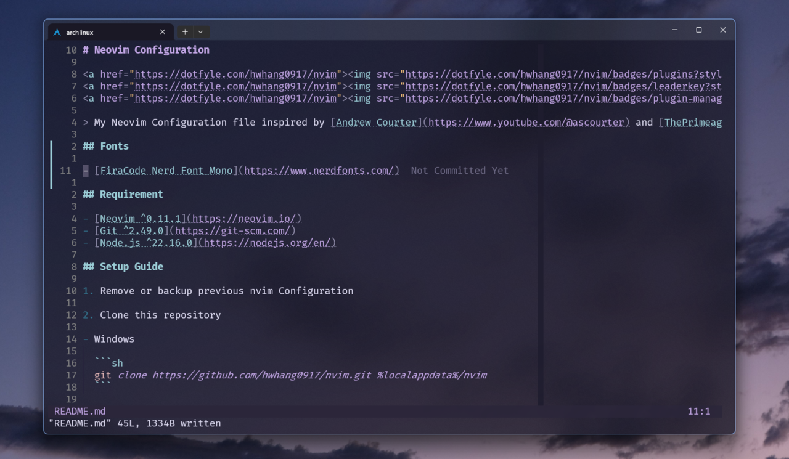

# Neovim Configuration



<a href="https://dotfyle.com/hwhang0917/nvim"></a>
<a href="https://dotfyle.com/hwhang0917/nvim"></a>
<a href="https://dotfyle.com/hwhang0917/nvim"></a>

> My Neovim Configuration file inspired by [Andrew Courter](https://www.youtube.com/@ascourter) and [ThePrimeagen](https://www.youtube.com/ThePrimeagen)

## Fonts

- [FiraCode Nerd Font Mono](https://www.nerdfonts.com/)

## Requirement

- [Neovim ^0.11.1](https://neovim.io/)
- [Git ^2.49.0](https://git-scm.com/)
- [Node.js ^22.16.0](https://nodejs.org/en/)

## Setup Guide

1. Remove or backup previous nvim Configuration

2. Clone this repository

- Windows

  ```sh
  git clone https://github.com/hwhang0917/nvim.git %localappdata%/nvim
  ```

- Unix-Like

  ```sh
  git clone https://github.com/hwhang0917/nvim.git ~/.config/nvim
  ```

## Local Configuration

Machine-specific settings (LLM model, backend URL, etc.) are stored in a gitignored file.

```sh
cp lua/runfridge/local.lua.example lua/runfridge/local.lua
```

Edit `local.lua` to match your setup:

```lua
return {
    llm_model = "qwen2.5-coder:1.5b-base",
    llm_backend = "ollama",
    llm_url = "http://localhost:11434",
}
```

> Requires [Ollama](https://ollama.com/) running locally with the configured model pulled.

## Testing with Docker

You can test the configuration in a clean Arch Linux container without affecting your local setup.

```sh
docker compose run --rm nvim
```

First run installs system dependencies and bootstraps plugins. Subsequent runs are faster thanks to cached volumes.
